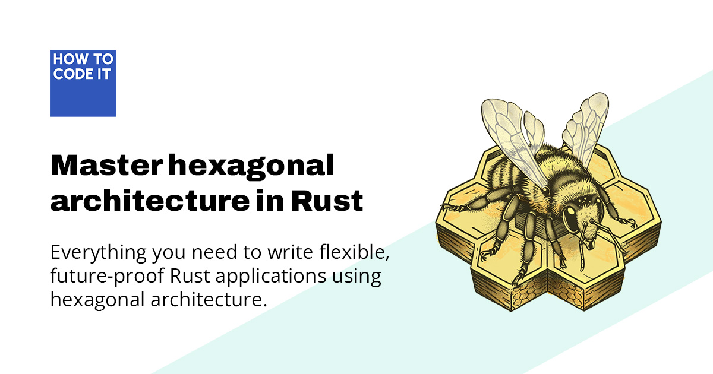

The complete code
for [_Master Hexagonal Architecture in Rust_](https://www.howtocodeit.com/articles/master-hexagonal-architecture-rust).

This repo is divided into branches corresponding to different parts of the guide:

* 1-very-bad-app: how not to build a Rust application.
* 2-slightly-better-app: a distinct improvement that separates the repository from the HTTP handlers. Recommended for
  apps without significant domain logic.
* 3-simple-service: demonstrates the `Service` trait and provides a general-purpose template for hexagonal Rust apps.
